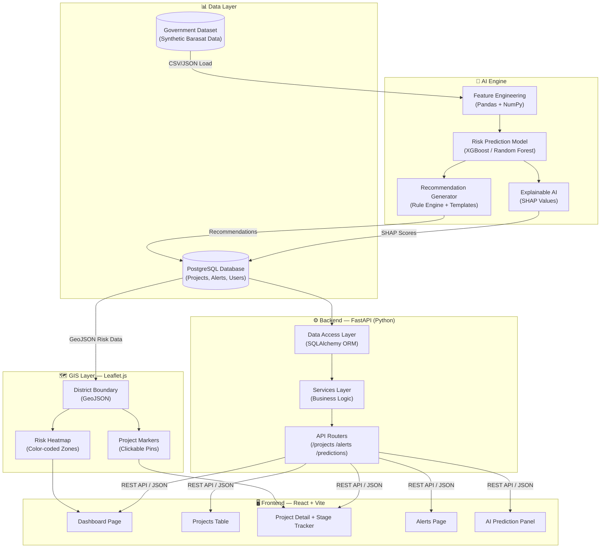
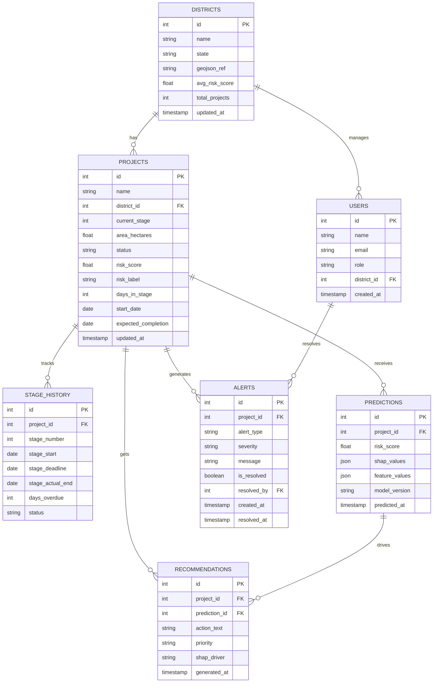
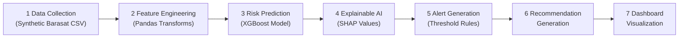

# 🛡️ LandGuard AI — Project Blueprint

> **Smart India Hackathon 2026 | Problem Statement: SIH26017**
> Department of Land Resources (DoLR), Ministry of Rural Development
> Pilot District: North 24 Parganas (Barasat), West Bengal

---

<div align="center">

| 📋 Document Type | Master Project Blueprint |
|---|---|
| 🗓️ Created | September 2026 |
| 👥 Team Size | 6 Members |
| ⏱️ Build Timeline | 5 Days |
| 🏛️ Governing Act | RFCTLARR Act, 2013 |
| 🗺️ Pilot District | North 24 Parganas, West Bengal |

</div>

---

## 📑 Table of Contents

1. [Project Vision](#1-project-vision)
2. [MVP Scope](#2-mvp-scope-what-we-will-build)
3. [User Roles](#3-user-roles)
4. [Complete Project Architecture](#4-complete-project-architecture)
5. [Folder Structure](#5-folder-structure)
6. [Backend Roadmap](#6-backend-roadmap)
7. [Frontend Roadmap](#7-frontend-roadmap)
8. [Database Design](#8-database-design)
9. [AI Prediction Pipeline](#9-ai-prediction-pipeline)
10. [RFCTLARR Seven-Stage Mapping](#10-rfctlarr-seven-stage-mapping)
11. [Dataset Planning](#11-dataset-planning)
12. [GIS Planning](#12-gis-planning)
13. [Prototype Screen Mapping](#13-prototype-screen-mapping)
14. [Team Task Distribution](#14-team-task-distribution)
15. [Five-Day Execution Timeline](#15-five-day-execution-timeline)
16. [Deliverables Checklist](#16-deliverables-checklist)

---

## 1. 🌟 Project Vision

### What Problem Does LandGuard AI Solve?

When the government acquires land for roads, railways, power lines, or schools, a detailed legal process must be followed under the **RFCTLARR Act, 2013** (Right to Fair Compensation and Transparency in Land Acquisition, Rehabilitation and Resettlement Act). This process has **7 distinct stages** — from initial notification to final possession.

**The Problem:**
> Land acquisition projects in India frequently stall for **months or even years** because delays are only noticed **after** they have already happened. By then, courts are involved, budgets are blown, and affected families are still displaced without compensation.

No existing system **predicts** where a delay is about to occur. Officers only know a stage is delayed when deadlines are missed. This is called **reactive monitoring** — you react after the problem.

### Why Predictive Monitoring is Better

| Feature | ❌ Reactive Monitoring | ✅ Predictive Monitoring (LandGuard AI) |
|---|---|---|
| **When you know** | After deadline missed | Weeks before deadline |
| **Action possible?** | No (damage done) | Yes (intervene early) |
| **Data used** | Manual records | Historical patterns + AI |
| **Transparency** | Low | High — SHAP explanations |
| **Outcome** | Delays compound | Delays prevented |

**Predictive monitoring** means our AI model studies historical land acquisition data, learns the warning signs of delay, and raises an alert *before* a stage goes overdue. Officers can then intervene — reassign staff, escalate approvals, or check for objections — before the delay becomes a crisis.

### Alignment with RFCTLARR Act and SIH26017

The **RFCTLARR Act, 2013** mandates strict timelines at each acquisition stage. Violations attract legal penalties and compensation escalations. SIH Problem Statement **SIH26017** specifically asks for:

> *"A Predictive Analytics System for Early Detection of Land Acquisition Delays"*

LandGuard AI directly answers this by:
- Mapping every project to its current RFCTLARR stage
- Using AI to predict which stages are at risk
- Generating explainable alerts with recommended corrective actions
- Visualizing all of this on a GIS district map for field officers

---

## 2. 📦 MVP Scope (What We Will Build)

### ✅ Included in MVP

> **MVP = Minimum Viable Product.** These are the features we will build and demonstrate on Day 5.

| # | Feature | Description |
|---|---|---|
| 1 | **AI Risk Dashboard** | Central hub showing all projects, risk scores, and summary statistics |
| 2 | **Project Monitoring** | A filterable table of all land acquisition projects with stage and status |
| 3 | **District Heatmap** | Interactive GIS map of North 24 Parganas color-coded by risk level |
| 4 | **Alerts Module** | Auto-generated alerts for high-risk or overdue project stages |
| 5 | **Recommendation Engine** | AI-generated plain-English advice for each at-risk project |
| 6 | **Stage Tracker** | Visual timeline of the 7 RFCTLARR stages for any project |
| 7 | **Project Detail Page** | Full deep-dive per project: history, AI prediction, SHAP chart, alerts |

### ❌ Not Included (Out of Scope)

> These are excluded to keep the project buildable in 5 days.

- 🔐 Real government SSO / login system (we use a mock auth layer)
- 🌐 Live API integrations with DoLR/DILRMP portals
- 🛰️ Real-time satellite imagery
- 📱 Mobile application
- 🏦 Actual payment disbursement tracking
- 🗂️ Document upload & verification workflows

---

## 3. 👤 User Roles

> **Think of roles like different types of access cards.** Each role sees the same dashboard but can do different things.

| Role | Who They Are | Permissions | Restrictions |
|---|---|---|---|
| **District Officer** | Field-level official (e.g., Barasat Collector's office) | View projects in their district; receive alerts; read recommendations; update stage status | Cannot see other districts; cannot change AI settings |
| **State Admin** | West Bengal state-level land acquisition coordinator | View all districts in WB; generate state-wide reports; manage district officers | Cannot modify AI model parameters |
| **Central Dashboard Viewer** | DoLR/Ministry of Rural Development analyst | Read-only access to all states; download national risk reports; view aggregate statistics | Cannot write any data; view-only access |

> **For the Hackathon Demo:** All three roles will be shown with a simple role-switcher button — no real authentication required.

---

## 4. 🏗️ Complete Project Architecture

### System Architecture Diagram



### Component Explanations

| Component | Technology | What It Does |
|---|---|---|
| **Government Dataset** | CSV / JSON (Synthetic) | Source data mimicking DoLR records for Barasat district |
| **Feature Engineering** | Python, Pandas | Transforms raw data into AI-ready features (delay ratios, stage durations, etc.) |
| **Risk Prediction Model** | XGBoost / Random Forest | Predicts the probability of delay for each project stage (0–100% risk score) |
| **Explainable AI (SHAP)** | SHAP library | Explains *why* the model gave a risk score — e.g., "objections pending is the #1 cause" |
| **Recommendation Generator** | Python rule engine | Converts SHAP insights into plain-English action items for officers |
| **PostgreSQL Database** | PostgreSQL + SQLAlchemy | Stores all projects, risk scores, alerts, users, and recommendations persistently |
| **FastAPI Backend** | Python, FastAPI | Exposes REST API endpoints consumed by the frontend |
| **React Frontend** | React, Vite, Chart.js | The web UI — renders dashboards, tables, charts, and detail pages |
| **Leaflet.js GIS** | Leaflet.js + GeoJSON | Interactive map layer overlaid on the dashboard |

---

## 5. 📁 Folder Structure

> **Every folder has a specific job.** Think of folders like departments in an office — each department handles one type of work.

```
SIH26017-LandGuard-AI/
│
├── 📂 backend/                  ← FastAPI APIs
├── 📂 frontend/                 ← Next.js Dashboard
├── 📂 ai_model/                 ← XGBoost + SHAP
│
├── 📂 dataset/
│   ├── raw/
│   ├── processed/
│   ├── synthetic/
│   └── metadata/
│
├── 📂 gis/
│   ├── geojson/
│   ├── shapefiles/
│   └── maps/
│
├── 📂 prototype_assets/
│   ├── icons/
│   ├── charts/
│   ├── screenshots/
│   └── mockups/
│
├── 📂 docs/
│   ├── PROJECT_BLUEPRINT.md     ⭐ Master document
│   ├── API_DOCUMENTATION.md
│   ├── DATABASE_SCHEMA.md
│   ├── Research_Bible/
│   ├── PPT/
│   └── Meeting_Notes/
│
├── 📄 README.md
└── 📄 .gitignore
```

---

### 📂 `backend/`

**Why it exists:** This is the "engine room" of the application. The backend receives requests from the frontend ("give me all high-risk projects"), talks to the database, runs business logic, and returns JSON responses.

**What belongs here:**
```
backend/
├── core/           ← App config, database connection, security settings
├── models/         ← Database table definitions (SQLAlchemy ORM models)
├── routers/        ← API route handlers (URL → function mapping)
├── services/       ← Business logic (e.g., calculate risk, generate alerts)
├── schemas/        ← Pydantic schemas for request/response validation
├── utils/          ← Helper functions (date formatting, risk scoring)
├── data/           ← Seed scripts and initial data loaders
├── main.py         ← FastAPI app entry point
└── requirements.txt
```

---

### 📂 `frontend/`

**Why it exists:** Everything the user *sees* and *clicks*. The frontend is a **Next.js** application that fetches data from the backend API and renders it beautifully. Next.js gives us server-side rendering (faster initial load) and file-based routing out of the box.

**What belongs here:**
```
frontend/
├── app/
│   ├── dashboard/    ← Dashboard page route
│   ├── projects/     ← Projects list + [id] detail routes
│   ├── map/          ← GIS heatmap page
│   ├── alerts/       ← Alerts feed page
│   ├── predictions/  ← AI prediction panel page
│   └── layout.tsx    ← Shared navigation shell
├── components/       ← Reusable UI pieces (cards, tables, charts)
├── services/         ← API call functions (axios/fetch wrappers)
├── hooks/            ← Custom React hooks
├── context/          ← Global state (selected district, user role)
├── public/           ← Static assets (icons, fonts)
├── next.config.js
└── package.json
```

---

### 📂 `dataset/`

**Why it exists:** All raw, processed, and synthetic data lives here. AI models need clean data — this folder is where raw government-style CSVs are converted into model-ready datasets.

**What belongs here:**
```
dataset/
├── raw/            ← Original unmodified data (CSV, Excel)
├── processed/      ← Cleaned and feature-engineered data
├── synthetic/      ← AI-generated demo data (Barasat district)
└── metadata/       ← Data dictionaries, column descriptions, sources
```

---

### 📂 `docs/`

**Why it exists:** The single source of truth for all project documentation — from the master blueprint to meeting notes. This is what evaluators and team members read to understand the project.

**What belongs here:**
```
docs/
├── PROJECT_BLUEPRINT.md   ← ⭐ This master document (primary reference)
├── API_DOCUMENTATION.md   ← All REST API endpoints with request/response examples
├── DATABASE_SCHEMA.md     ← Full database schema with column descriptions
├── Research_Bible/        ← RFCTLARR research, DoLR references, domain notes
├── PPT/                   ← PowerPoint presentation files and exported slides
└── Meeting_Notes/         ← Daily standup logs, decision records, blockers
```

---

### 📂 `gis/`

**Why it exists:** All geospatial files for the interactive map. GeoJSON files define the shapes of districts and zones. Shapefiles are the raw GIS data format from official government sources.

**What belongs here:**
```
gis/
├── geojson/        ← GeoJSON boundary and risk-enriched heatmap files
├── shapefiles/     ← Raw shapefiles from Survey of India / census
└── maps/           ← Exported map images, legend assets, tile configs
```

---

### 📂 `prototype_assets/`

**Why it exists:** All visual assets used across the PPT, SIH submission form, and README. Keeping them organized by type makes it easy to find the right asset during crunch time.

**What belongs here:**
```
prototype_assets/
├── icons/          ← Custom SVG/PNG icons used in the UI and slides
├── charts/         ← Exported chart images (risk trends, stage distributions)
├── screenshots/    ← Full-page screenshots of all 6 prototype screens
└── mockups/        ← Figma/design exports and wireframe images
```

---

### 📂 `ai_model/`

**Why it exists:** All machine learning code is isolated here. This separation means the AI team can work independently without breaking the backend or frontend.

**What belongs here:**
```
ai_model/
├── notebooks/          ← Jupyter notebooks for exploration and training
├── training/           ← Model training scripts
├── saved_models/       ← Serialized model files (.pkl, .joblib)
├── evaluation/         ← Model accuracy reports, confusion matrices
└── shap_outputs/       ← Pre-computed SHAP value exports
```

---

## 6. ⚙️ Backend Roadmap

> **FastAPI** is our backend framework. It is like an "office receptionist" — it receives requests, passes them to the right department, and sends back responses.

### Module Breakdown

#### 📁 `core/`
The foundation of the backend. Think of this as the "rules and settings" module.

| File | Purpose |
|---|---|
| `config.py` | Reads environment variables (DB URL, secret key, debug mode) |
| `database.py` | Creates the database connection and session factory |
| `security.py` | Handles JWT token creation and password hashing (for mock auth) |
| `dependencies.py` | Shared FastAPI dependencies (e.g., get current user) |

---

#### 📁 `models/`
SQLAlchemy ORM models — these define what the database tables look like in Python code.

| File | Database Table | Columns |
|---|---|---|
| `project.py` | `projects` | id, name, district, stage, risk_score, status, area_ha, started_at |
| `alert.py` | `alerts` | id, project_id, type, severity, message, created_at, is_resolved |
| `recommendation.py` | `recommendations` | id, project_id, action, priority, generated_at |
| `district.py` | `districts` | id, name, state, geojson_ref, avg_risk |
| `user.py` | `users` | id, name, role, district_id, email |

---

#### 📁 `routers/`
Each router file is a "department" that handles one category of API requests.

| File | URL Prefix | Responsibility |
|---|---|---|
| `projects.py` | `/api/v1/projects` | CRUD for land acquisition projects |
| `alerts.py` | `/api/v1/alerts` | Fetch and manage alerts |
| `predictions.py` | `/api/v1/predictions` | Trigger AI prediction, return risk score + SHAP |
| `districts.py` | `/api/v1/districts` | District-level summaries and GeoJSON data |
| `recommendations.py` | `/api/v1/recommendations` | Fetch recommendations per project |
| `users.py` | `/api/v1/users` | User profile and role management |

---

#### 📁 `services/`
Business logic lives here. Routers are thin; services do the heavy lifting.

| File | What It Does |
|---|---|
| `prediction_service.py` | Loads the saved ML model, runs prediction, returns risk score |
| `alert_service.py` | Evaluates projects and creates Alert records for high-risk stages |
| `recommendation_service.py` | Converts SHAP explanations into human-readable recommendations |
| `gis_service.py` | Enriches district GeoJSON with current risk scores for the heatmap |
| `report_service.py` | Generates downloadable CSV/PDF summary reports |

---

#### 📁 `schemas/`
Pydantic schemas define the exact shape of API request and response data. This prevents bad data from entering or leaving the system.

```python
# Example: ProjectResponse schema
class ProjectResponse(BaseModel):
    id: int
    name: str
    district: str
    current_stage: int       # 1-7
    risk_score: float        # 0.0-1.0
    risk_label: str          # "LOW" | "MEDIUM" | "HIGH" | "CRITICAL"
    status: str
    days_in_stage: int
```

---

#### 📁 `utils/`
Small helper functions used across the codebase.

| File | Helpers Inside |
|---|---|
| `risk_calculator.py` | Convert raw model score to label (LOW/MEDIUM/HIGH/CRITICAL) |
| `date_helpers.py` | Calculate days overdue, stage duration limits |
| `geojson_helpers.py` | Merge risk scores into GeoJSON feature properties |
| `seed_helpers.py` | Load synthetic CSV data into the database |

---

### 🔌 Key API Endpoints

```
GET    /api/v1/projects                     → List all projects (filterable by district, stage, risk)
GET    /api/v1/projects/{id}                → Single project detail
PATCH  /api/v1/projects/{id}/stage          → Update current stage (District Officer)

GET    /api/v1/alerts                       → All active alerts (filterable)
PATCH  /api/v1/alerts/{id}/resolve          → Mark alert as resolved

POST   /api/v1/predictions/{project_id}     → Run AI prediction, return score + SHAP values
GET    /api/v1/predictions/{project_id}     → Fetch last cached prediction

GET    /api/v1/districts                    → All districts with risk summary
GET    /api/v1/districts/{id}/geojson       → GeoJSON for heatmap rendering

GET    /api/v1/recommendations/{project_id} → Get recommendations for a project

GET    /api/v1/dashboard/summary            → Aggregated stats (total projects, avg risk, critical count)
```

---

## 7. 🖥️ Frontend Roadmap

> The frontend is the face of LandGuard AI. Built with **React + Vite**, it is a Single Page Application (SPA) — meaning navigation is instant, with no full page reloads.

### Screen 1 — 🏠 Dashboard (Home)

**URL:** `/dashboard`
**Who sees this:** All roles (filtered by their scope)

**What the user sees:**
- A top navigation bar with the LandGuard AI logo and role switcher
- **4 KPI Cards:** Total Projects | Active Alerts | High Risk Projects | Avg Risk Score
- **Risk Score Trend Chart** — Line chart showing risk score over the past 30 days
- **Stage Distribution Donut Chart** — How many projects are at each of the 7 stages
- **Top 5 Critical Projects** — Quick-access cards for the most urgent cases
- **Mini District Heatmap** (embedded, click to expand)

---

### Screen 2 — 📋 Projects (Project Monitoring)

**URL:** `/projects`
**Who sees this:** All roles

**What the user sees:**
- A searchable, filterable data table of all land acquisition projects
- **Filters:** District | Stage (1–7) | Risk Level | Status | Date Range
- **Columns:** Project Name | District | Current Stage | Risk Score Badge | Days in Stage | Status | Actions
- Color-coded risk badges: 🟢 Low | 🟡 Medium | 🔴 High | 🚨 Critical
- Clicking a row navigates to the Project Detail page

---

### Screen 3 — 🔍 Project Detail Page

**URL:** `/projects/:id`
**Who sees this:** All roles

**What the user sees:**
- Project header: Name, District, Total Area (ha), Start Date
- **Stage Tracker** — A horizontal 7-step progress bar showing completed, current, and future stages with color coding
- **AI Risk Panel** — Gauge chart showing current risk score; SHAP waterfall chart explaining top 5 factors
- **Recommendations List** — Numbered action items derived from SHAP analysis
- **Alert History** — All alerts ever generated for this project
- **Stage Timeline Table** — Stage | Start Date | Deadline | Actual End | Days Overdue

---

### Screen 4 — 🗺️ GIS Map (District Heatmap)

**URL:** `/map`
**Who sees this:** All roles

**What the user sees:**
- Full-screen interactive **Leaflet.js** map of North 24 Parganas
- District sub-zones color-coded by average risk (green → red gradient)
- **Clickable project pins** — click to see a popup with project name, stage, and risk score
- **Legend** in the corner explaining the color scale
- **Filter Panel** — show only HIGH/CRITICAL risk projects on the map
- Sidebar with a ranked list of zones by risk level

---

### Screen 5 — 🤖 AI Prediction Panel

**URL:** `/predictions`
**Who sees this:** District Officer, State Admin

**What the user sees:**
- A project selector dropdown
- **"Run Prediction" button** — calls the backend prediction API
- **Risk Score Gauge** — animated semicircle gauge showing 0–100%
- **SHAP Waterfall Chart** — visual breakdown of which features pushed the risk up or down
- **Feature Importance Table** — lists the top 10 most influential features with their values
- Confidence interval and model accuracy stats shown at the bottom

---

### Screen 6 — 🔔 Alerts

**URL:** `/alerts`
**Who sees this:** All roles

**What the user sees:**
- Alert feed sorted by severity and recency
- **Alert Card:** Contains severity badge | Project name | Stage | Alert message | Created time | Resolve button
- **Filter:** Severity | District | Resolved / Unresolved | Date
- **Alert Statistics Chart** — Bar chart showing alert volume by day over the last 14 days
- Clicking an alert card navigates to the Project Detail page

---

## 8. 🗄️ Database Design

### Entity Relationship Diagram



### Relationship Summary

| Relationship | Type | Meaning |
|---|---|---|
| District → Projects | One-to-Many | One district has many land acquisition projects |
| District → Users | One-to-Many | One district can have multiple officers |
| Project → Stage History | One-to-Many | Each project passes through multiple stages over time |
| Project → Predictions | One-to-Many | A project can be re-predicted as new data comes in |
| Project → Alerts | One-to-Many | One project can trigger multiple alerts across stages |
| Prediction → Recommendations | One-to-Many | Each prediction generates multiple action recommendations |

---

## 9. 🤖 AI Prediction Pipeline

> **How does the AI know a project is about to be delayed?** It learns from history. Projects that were delayed in the past left "fingerprints" in the data — specific patterns of features. The model learns these fingerprints and matches them in new projects.



### Step-by-Step Explanation

#### Step 1 — Data Collection 📥
- Source: Synthetic datasets modeled after DoLR/DILRMP records for Barasat
- Format: CSV with project metadata, stage dates, objection counts, compensation amounts
- Volume: ~500–1000 synthetic project records across 7 stages

#### Step 2 — Feature Engineering 🔧
Transform raw columns into AI-meaningful numbers:

| Raw Data | Engineered Feature |
|---|---|
| Stage start date + today | `days_in_current_stage` |
| Stage deadline - stage start | `stage_allowed_duration` |
| days_in_stage / stage_allowed_duration | `stage_completion_ratio` |
| Count of pending objections | `objection_count` |
| Compensation amount / area | `compensation_per_hectare` |
| Previous stages overdue count | `historical_delay_count` |
| District's average overdue rate | `district_delay_rate` |

#### Step 3 — Risk Prediction 🎯
- Model: **XGBoost Classifier** (or Random Forest as fallback)
- Output: Probability score between 0.0 and 1.0
- Labels: `LOW` (0–0.35) | `MEDIUM` (0.35–0.60) | `HIGH` (0.60–0.80) | `CRITICAL` (0.80–1.0)
- Training: 80/20 train-test split on synthetic data
- Validation: Cross-validation with F1-score reporting

#### Step 4 — Explainable AI (SHAP) 🔍
- **SHAP = SHapley Additive exPlanations**
- Think of it as a "blame attribution" system: SHAP tells you exactly which features pushed the risk score up or down, and by how much
- Example SHAP output: `"objection_count (+0.18) stage_completion_ratio (+0.14) district_delay_rate (+0.09)"`
- This is visualized as a waterfall chart on the Project Detail page

#### Step 5 — Alert Generation 🚨
Rules applied after prediction:
```
IF risk_score >= 0.80   → Create CRITICAL alert
IF risk_score >= 0.60   → Create HIGH alert
IF days_overdue > 0     → Create DEADLINE MISSED alert
IF stage == 3 AND objections > 5 → Create OBJECTION BACKLOG alert
```

#### Step 6 — Recommendation Generation 💡
SHAP top drivers are converted into plain-English actions:

| SHAP Top Driver | Generated Recommendation |
|---|---|
| `objection_count` is high | "Schedule objection resolution hearings within 7 days" |
| `district_delay_rate` is high | "Escalate to State Admin for additional staff support" |
| `stage_completion_ratio` near 1.0 | "Urgent: Stage approaching deadline — request extension or fast-track approval" |
| `compensation_per_hectare` low | "Review compensation valuation — disputes likely if below district average" |

#### Step 7 — Dashboard Visualization 📊
- Risk scores stored in PostgreSQL → fetched by FastAPI → rendered by React
- SHAP values stored as JSON → rendered as Chart.js waterfall chart
- GeoJSON enriched with district-level avg risk → rendered as Leaflet.js heatmap

---

## 10. 🏛️ RFCTLARR Seven-Stage Mapping

> The **Right to Fair Compensation and Transparency in Land Acquisition, Rehabilitation and Resettlement Act (RFCTLARR), 2013** defines 7 mandatory stages for every government land acquisition. LandGuard AI tracks each stage for every project.

| Stage | Stage Name | Purpose | Statutory Timeline | AI Predicts | Output |
|---|---|---|---|---|---|
| **1** | Preliminary Notification (Section 11) | Government announces intent to acquire land | 30 days for objections | Probability of objection surge | Objection volume alert |
| **2** | Social Impact Assessment (SIA) | Evaluate social and economic impact on affected families | 6 months | Probability of SIA stalling | SIA delay score + escalation recommendation |
| **3** | Expert Group Review | Independent expert panel reviews SIA findings | 2 months | Probability of rejection | Expert objection risk flag |
| **4** | Government Approval (Section 19 Declaration) | Official government declaration of acquisition intent | 12 months from SIA start | Probability of approval delay | Approval bottleneck alert |
| **5** | Award Announcement (Section 26-30) | Land valuation, compensation calculation, and award to landowners | 2 years from declaration | Probability of award dispute | Compensation dispute risk |
| **6** | Compensation Disbursement | Actual payment made to landowners; bank transfer | Within 3 months of award | Probability of payment delay | Payment failure alert |
| **7** | Possession & Handover | Physical handover of land to the acquiring authority | Within 60 days of compensation | Probability of possession dispute | Possession blockade alert |

> **Color coding used in dashboard:**
> - ⚪ Stage not started
> - 🔵 Stage in progress (within deadline)
> - 🟡 Stage at risk (>80% of allotted time used)
> - 🔴 Stage overdue

---

## 11. 📊 Dataset Planning

> **Important:** For the hackathon, we use **synthetic data** — data we generate ourselves that mimics real government records. We cannot access real DoLR data in 5 days.

### Dataset Folder Breakdown

#### 📁 `dataset/raw/`
Original unprocessed files. Never modify files in this folder — always copy to `processed/`.

| File | Description |
|---|---|
| `barasat_projects_raw.csv` | 500 synthetic project records with stage dates |
| `district_profile_n24pgs.csv` | North 24 Parganas district demographics and land area stats |
| `compensation_records.csv` | Compensation amounts by land type (agricultural, commercial, residential) |
| `objection_log.csv` | Historical objection filings per project |

#### 📁 `dataset/processed/`
Cleaned, feature-engineered files ready for model training.

| File | Description |
|---|---|
| `features_barasat.csv` | All engineered features (delay ratios, counts, etc.) |
| `labels_barasat.csv` | Binary labels — `1 = delayed`, `0 = on_time` |
| `train_set.csv` | 80% of data for model training |
| `test_set.csv` | 20% of data for model evaluation |

#### 📁 `dataset/synthetic/`
Scripts used to generate synthetic data.

| File | Description |
|---|---|
| `generate_barasat.py` | Python script to generate 500 synthetic project records |
| `barasat_demo.csv` | The final synthetic dataset used in the demo |
| `generate_alerts.py` | Script to seed realistic alert patterns |

#### 📁 `dataset/metadata/`
Documentation so anyone can understand the data.

| File | Description |
|---|---|
| `data_dictionary.md` | Definition of every column in every dataset |
| `data_sources.md` | Lists government datasets this synthetic data is modeled after |
| `assumptions.md` | Documents all assumptions made in synthetic data generation |

### Barasat Demo Datasets — Summary

```
North 24 Parganas (Barasat) Demo Data
─────────────────────────────────────────────────────
Total Projects:           500
High Risk Projects:       ~120 (24%)
Stages Covered:           All 7 (RFCTLARR)
Date Range:               2020–2026
Average Project Area:     12.4 hectares
Districts/Blocks:         8 blocks of North 24 Parganas
Total Alerts (seeded):    ~340
```

---

## 12. 🗺️ GIS Planning

> **GIS = Geographic Information System.** It is the technology that powers our interactive map. Instead of just a table of projects, the map lets you *see* where delays are happening geographically.

### GeoJSON

**What is it?** GeoJSON is a standard format for encoding geographic shapes as JSON. A polygon is a shape (like the outline of a district), and each polygon can have properties (like risk score or project count).

```json
{
  "type": "Feature",
  "geometry": {
    "type": "Polygon",
    "coordinates": [[[88.46, 22.72], [88.52, 22.72], [88.52, 22.76], [88.46, 22.76], [88.46, 22.72]]]
  },
  "properties": {
    "block_name": "Barasat I",
    "risk_score": 0.74,
    "risk_label": "HIGH",
    "active_projects": 23
  }
}
```

### District Boundary

- Source: Open government shapefiles (Survey of India / DIVA-GIS)
- Format: Converted to GeoJSON and stored in `gis/geojson/north_24_parganas_boundary.geojson`
- This defines the outer border and all internal block boundaries of North 24 Parganas

### Risk Heatmap

- The backend `gis_service.py` reads the base GeoJSON and injects the current average risk score into each block's properties
- The frontend Leaflet.js map reads these properties and applies a **color scale**: `green → yellow → orange → red`
- This creates the heatmap effect — red areas have high average risk, green areas are safe

### Pilot District Strategy

| Scope | Implementation | Files |
|---|---|---|
| **Pilot (Demo)** | North 24 Parganas, WB — 8 blocks, 500 projects | `n24_parganas_blocks.geojson` |
| **State Scale** | All districts of West Bengal — 23 districts | `west_bengal_districts.geojson` |
| **National Scale** | All states — load state-level GeoJSON | `india_states.geojson` |

**Scaling approach:** The architecture is already state/national ready. The GeoJSON file and the `district_id` reference in the database can be swapped to switch between pilot, state, and national views. No code changes needed — just swap the GeoJSON source.

---

## 13. 🗂️ Prototype Screen Mapping

> **This maps our PPT presentation slides to actual prototype screens.** Use this during the demo to know exactly which screen to show for each slide.

| PPT Slide # | Slide Title | Prototype Screen | URL | Key Feature to Demo |
|---|---|---|---|---|
| 1 | Title Slide | — | — | Introduce team and project name |
| 2 | Problem Statement | — | — | Explain SIH26017 |
| 3 | Why Predictive? | — | — | Show reactive vs predictive comparison |
| 4 | Solution Overview | Dashboard | `/dashboard` | Show KPI cards + heatmap overview |
| 5 | AI Risk Score | AI Prediction Panel | `/predictions` | Run a live prediction and show gauge |
| 6 | SHAP Explainability | Project Detail | `/projects/42` | Show SHAP waterfall chart |
| 7 | 7-Stage Tracker | Project Detail | `/projects/42` | Scroll to Stage Tracker section |
| 8 | GIS District Map | GIS Map | `/map` | Click on a red zone to show risk popup |
| 9 | Alerts & Monitoring | Alerts Page | `/alerts` | Show CRITICAL alert and resolve flow |
| 10 | Recommendations | Project Detail | `/projects/42` | Show recommendation list |
| 11 | Project Monitoring | Projects Table | `/projects` | Filter to HIGH risk, Stage 3 |
| 12 | Tech Stack | — | — | Architecture diagram slide |
| 13 | Dataset & Methodology | — | — | Explain synthetic data approach |
| 14 | Team & Timeline | — | — | Show team distribution |
| 15 | Future Roadmap | — | — | DILRMP integration, mobile app, real-time |

---

## 14. 👥 Team Task Distribution

> **Six members, five days. Every member has a primary role, but everyone should understand the full project.**

| Member | Role | Primary Responsibilities | Day 1 Focus | Day 5 Focus |
|---|---|---|---|---|
| **Member 1** | 🔧 Backend Lead | FastAPI setup, database models, API endpoints, seed data | Set up FastAPI + PostgreSQL, create all models | Final API testing, bug fixes |
| **Member 2** | 🎨 Frontend Lead | React + Vite setup, all 6 screens, API integration, responsiveness | Project setup, Dashboard + Projects pages | UI polish, animations, demo prep |
| **Member 3** | 🗺️ GIS Specialist | GeoJSON acquisition, Leaflet.js integration, heatmap, block boundaries | Source and validate North 24 Parganas GeoJSON | Map embedded in dashboard, project markers |
| **Member 4** | 🤖 AI Engineer | Dataset preprocessing, model training, SHAP integration, prediction API | Generate synthetic dataset, train baseline model | SHAP chart integration, tune thresholds |
| **Member 5** | 📊 Dataset Engineer | Synthetic data generation, data dictionary, schema design, seed scripts | Write synthetic data generator, validate schema | Data QA, final seed load into PostgreSQL |
| **Member 6** | 📑 PPT + Docs Lead | Presentation slides, README, blueprint document, screen recordings | Prepare PPT template, import architecture slides | Record demo video, finalize README + docs |

### Communication Protocol

- 🕙 **Daily Standup:** 10:00 AM — each member shares progress and blockers (10 mins max)
- 📢 **GitHub:** All code committed to main repo with descriptive commit messages
- 💬 **WhatsApp/Discord:** Async communication for quick questions
- 🚩 **Blockers:** Any blocker that takes > 2 hours to solve must be raised in the group immediately

---

## 15. 📅 Five-Day Execution Timeline

> **This is our battle plan. Stick to it.**

| Day | Theme | Deliverables | Priority | Expected Output |
|---|---|---|---|---|
| **Day 1** ⚙️ | Setup & Foundation | ✅ All repos cloned and set up<br>✅ FastAPI project initialized<br>✅ PostgreSQL schema created<br>✅ React + Vite initialized<br>✅ Synthetic data generator written<br>✅ GeoJSON sourced and validated | **CRITICAL** | Working backend with empty tables; working frontend shell; dataset ready to load |
| **Day 2** 🏗️ | Core Features | ✅ All SQLAlchemy models done<br>✅ CRUD API endpoints live<br>✅ AI model trained (baseline)<br>✅ SHAP values computed and saved<br>✅ Prediction API endpoint working<br>✅ Seed data loaded into PostgreSQL | **CRITICAL** | Live API returning real JSON; AI model producing risk scores; database populated |
| **Day 3** 🖥️ | Frontend Build | ✅ Dashboard screen complete<br>✅ Projects table with filters<br>✅ Project Detail with Stage Tracker<br>✅ Alerts page live<br>✅ GIS Map integrated with Leaflet<br>✅ Frontend connected to backend API | **HIGH** | Fully navigable frontend with real data from backend; map showing heatmap |
| **Day 4** 🤖 | AI Integration + Polish | ✅ SHAP waterfall chart in UI<br>✅ Recommendation engine wired<br>✅ Alert generation rules live<br>✅ Role switcher implemented<br>✅ Responsive design checked<br>✅ UI animations and micro-interactions | **HIGH** | Full end-to-end flow: project → prediction → SHAP → recommendations → alert |
| **Day 5** 🎯 | Demo Prep + Submission | ✅ Full end-to-end demo rehearsed<br>✅ PPT slides finalized<br>✅ README updated<br>✅ Demo walkthrough video recorded<br>✅ All bugs fixed<br>✅ PROJECT_BLUEPRINT.md reviewed | **CRITICAL** | Submission-ready project; polished demo video; complete documentation |

### ⏰ Daily Time Budget

```
09:00 – 09:15   Daily standup (all members)
09:15 – 13:00   Deep work block 1
13:00 – 14:00   Lunch + informal sync
14:00 – 18:00   Deep work block 2
18:00 – 18:30   Evening sync — share progress, raise blockers
18:30 – 21:00   Polish / buffer / documentation
```

---

## 16. ✅ Deliverables Checklist

> **Use this as your final quality gate before submission.**

### 🔧 Backend
- [ ] FastAPI app runs without errors (`uvicorn main:app --reload`)
- [ ] All database models created and migrated
- [ ] All API endpoints responding correctly (test with Swagger UI at `/docs`)
- [ ] Seed data successfully loaded (500 projects, alerts, recommendations)
- [ ] AI prediction endpoint returns risk score and SHAP values
- [ ] CORS configured for frontend origin
- [ ] `requirements.txt` up to date

### 🎨 Frontend
- [ ] React app builds without errors (`npm run build`)
- [ ] Dashboard screen renders with real API data
- [ ] Projects table with search and filter working
- [ ] Project Detail page with Stage Tracker and SHAP chart
- [ ] Alerts page with resolve functionality
- [ ] GIS Map heatmap loading correctly
- [ ] Role switcher works (District Officer / State Admin / Central Viewer)
- [ ] No broken links or missing API calls

### 🗺️ GIS
- [ ] North 24 Parganas district boundary GeoJSON available
- [ ] Block-level boundaries included (8 blocks)
- [ ] Risk scores injected into GeoJSON properties
- [ ] Heatmap color scale rendering correctly
- [ ] Project markers clickable with popup info
- [ ] Map legend accurate

### 📊 Dataset
- [ ] Synthetic data generator script working (`generate_barasat.py`)
- [ ] `barasat_demo.csv` contains 500 realistic project records
- [ ] All 7 RFCTLARR stages represented in dataset
- [ ] Feature engineering pipeline documented
- [ ] `data_dictionary.md` complete
- [ ] Train/test split files generated

### 🤖 AI Model
- [ ] Model trained and saved (`.pkl` / `.joblib`)
- [ ] Model achieves F1-score > 0.75 on test set
- [ ] SHAP values computed for all test predictions
- [ ] Recommendation generation logic working
- [ ] Alert thresholds calibrated and tested
- [ ] Model version tracked in prediction records

### 📑 Presentation
- [ ] 15-slide PPT complete (as per slide mapping table above)
- [ ] Architecture diagram included
- [ ] RFCTLARR stage mapping slide included
- [ ] Live demo flow prepared (follow Screen Mapping section)
- [ ] All team member names and roles shown on title slide
- [ ] SIH26017 problem statement quoted accurately

### 🎬 Demo
- [ ] Full demo rehearsed at least once end-to-end
- [ ] Demo video recorded (5–7 minutes)
- [ ] Demo data loads correctly every time (use seeded database)
- [ ] Fallback: screenshots ready in case live demo fails

### 📄 README
- [ ] `README.md` at project root includes:
  - [ ] Project description and SIH problem number
  - [ ] Tech stack list
  - [ ] Setup instructions (backend + frontend)
  - [ ] How to seed the database
  - [ ] Screenshots of all 6 screens
  - [ ] Team member credits

---

## 🏁 Final Notes for the Team

> **Read this before you start Day 1.**

1. **Keep it simple first.** Get something working, then make it beautiful. A broken beautiful app is worse than an ugly working one.

2. **Commit often.** Use git commits after every major feature: `git commit -m "feat: add projects API endpoint"`. If something breaks, you can roll back.

3. **Use the `/docs` endpoint.** FastAPI auto-generates interactive API docs at `http://localhost:8000/docs`. Use this to test your endpoints before the frontend is ready.

4. **Mock data first.** If an API is not ready, the frontend can use hardcoded JSON for now. The API will replace it later.

5. **The GIS map is the wow factor.** Make sure the heatmap looks polished — it is the most visually impressive part of the demo.

6. **Practice the story.** The judges evaluate the solution to the problem, not just the tech. Be able to explain: *"Without LandGuard AI, an officer in Barasat would miss this delay. With LandGuard AI, they get an alert 3 weeks early."*

---

<div align="center">

---

**LandGuard AI** | Smart India Hackathon 2026 | SIH26017

*Built with ❤️ for the Department of Land Resources, Ministry of Rural Development*

*Empowering officers. Protecting rights. Preventing delays.*

</div>
